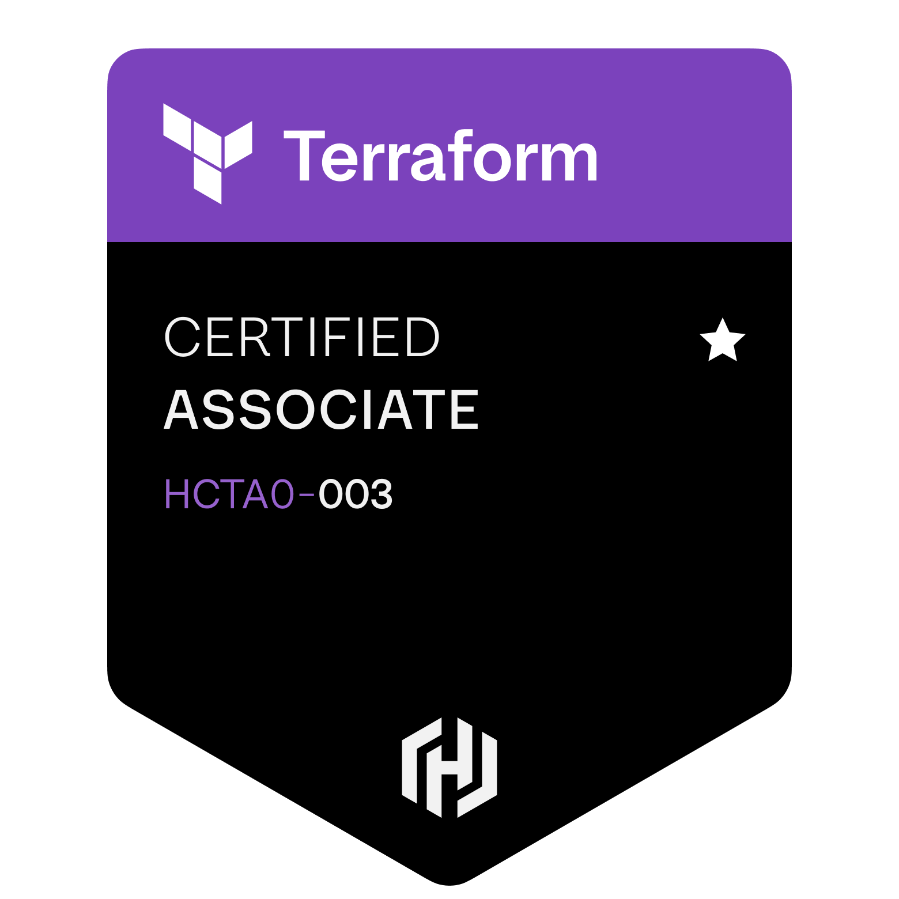
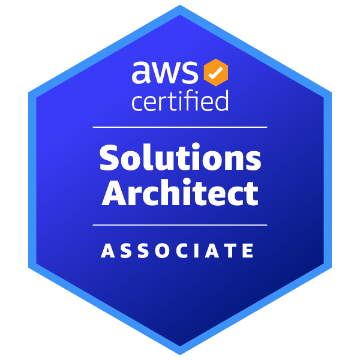
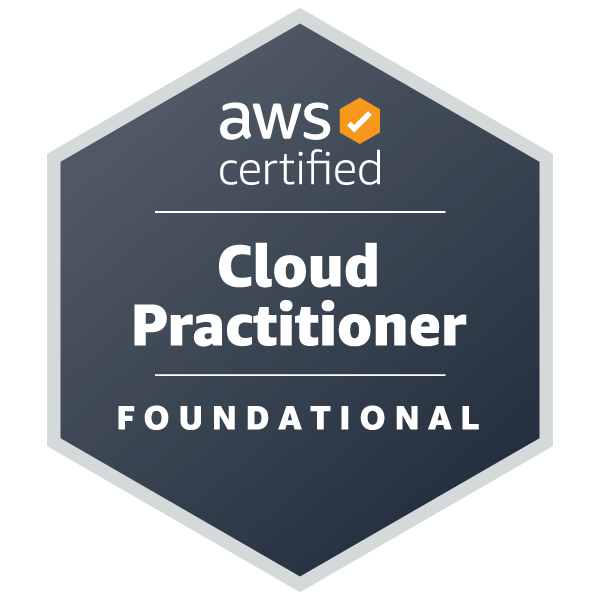

# Hi 👋, I'm Baalavignesh Arunachalam

  <h3>Software Engineer | Cloud Architect | Full Stack Developer</h3>
  
Passionate about building scalable applications and cloud architecture

  

### 🏆 Certifications

  
  
  

### 🏅 Hackathon Achievements

- **Best Prototype Award** @ Story3 HackerEarth
  - Project: NewEnd - GenMode
  - AI-driven storytelling platform with dynamic narrative branches

- **Honorable Mentions** @ DataPalooza
  - Project: HealthHub
  - Healthcare appointment and community health alert platform

### 🛠 Tech Stack

#### Languages & Frameworks

  
  
  
  
  
  
  
  

#### Cloud & DevOps

  
  
  
  
  
  

#### Databases & Tools

  
  
  
  
  
  
  

### 💼 Work Experience

- **Software Engineer** @ [Motate](https://motate.io/) _(May 2024 - Present)_
  - Building serverless multilingual content platform using AWS Lambda/API Gateway
  - Implementing Terraform/GitHub Actions for AWS environments
  - Optimizing DynamoDB schemas with secondary indexes

- **Associate Engineer** @ [Presidio](https://www.presidio.com/) _(Sep 2023 - Jul 2024)_
  - Developed internal learning platforms and retro tools using React and AWS
  - Worked on WebRTC, CI/CD pipeline design, and mobile app development
  - Gained expertise in Azure, DevOps, Flutter, Kotlin, AWS, and React Native

- **Software Engineer Intern** @ [Toast](https://pos.toasttab.com/) _(Jun 2022 - Jul 2022)_
  - Developed full-stack application using React and AWS services
  - Implemented API Gateway, Lambda, and DynamoDB architecture
  - Optimized frontend and backend components for performance
  
### 🌐 Connect with me

  
  
  

### 📫 How to reach me
- Email: **baalavignesh21@gmail.com**
- LinkedIn: [baalavignesh21](https://www.linkedin.com/in/baalavignesh21/)
- GitHub: [baalavignesh](https://github.com/baalavignesh)

  

