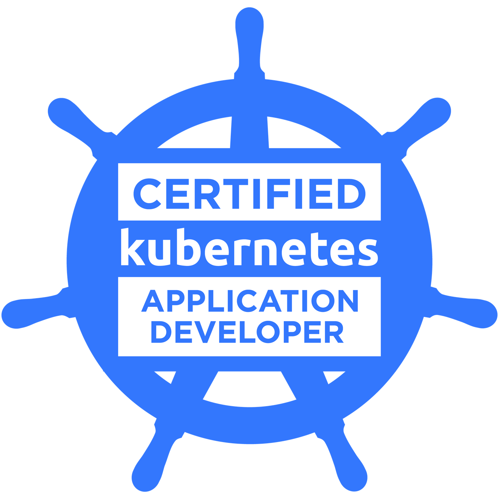
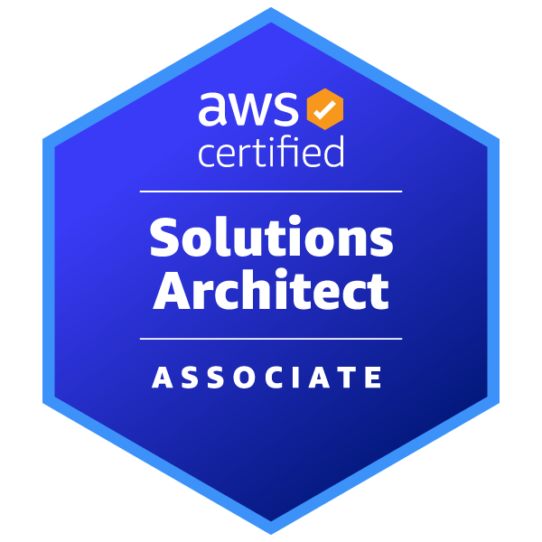
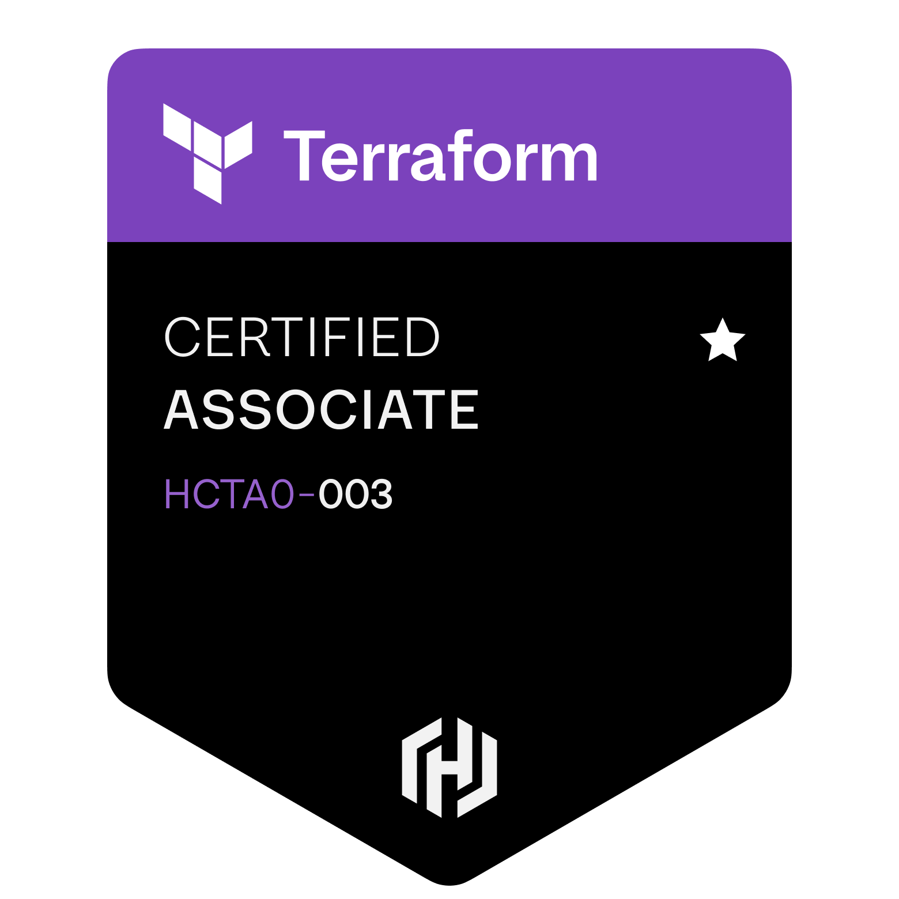
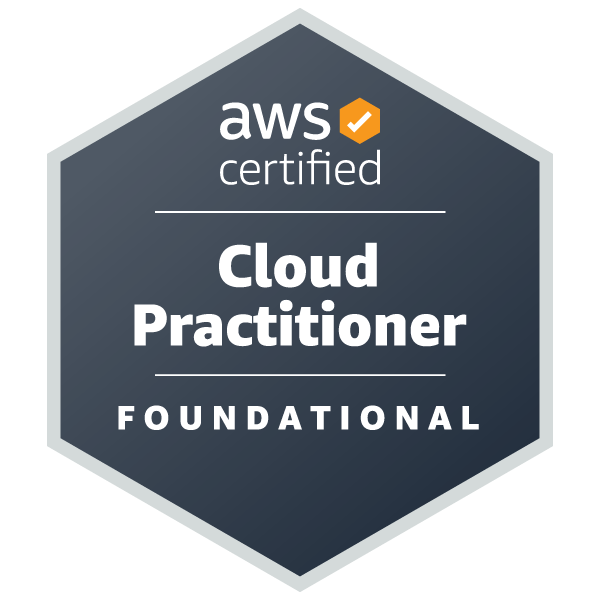
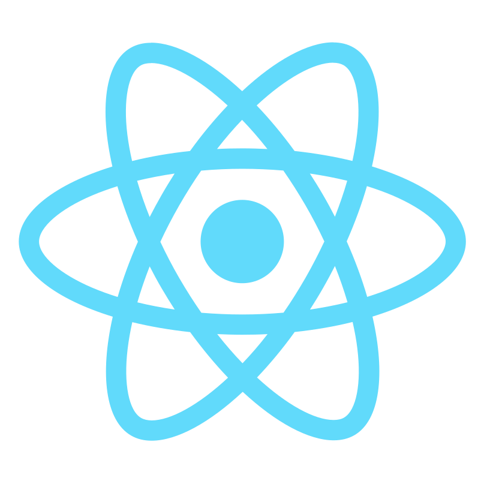
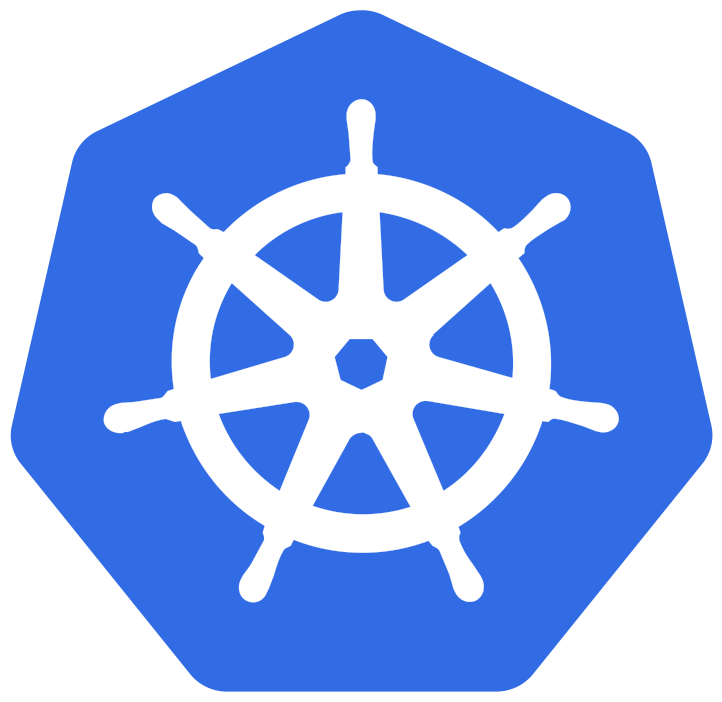
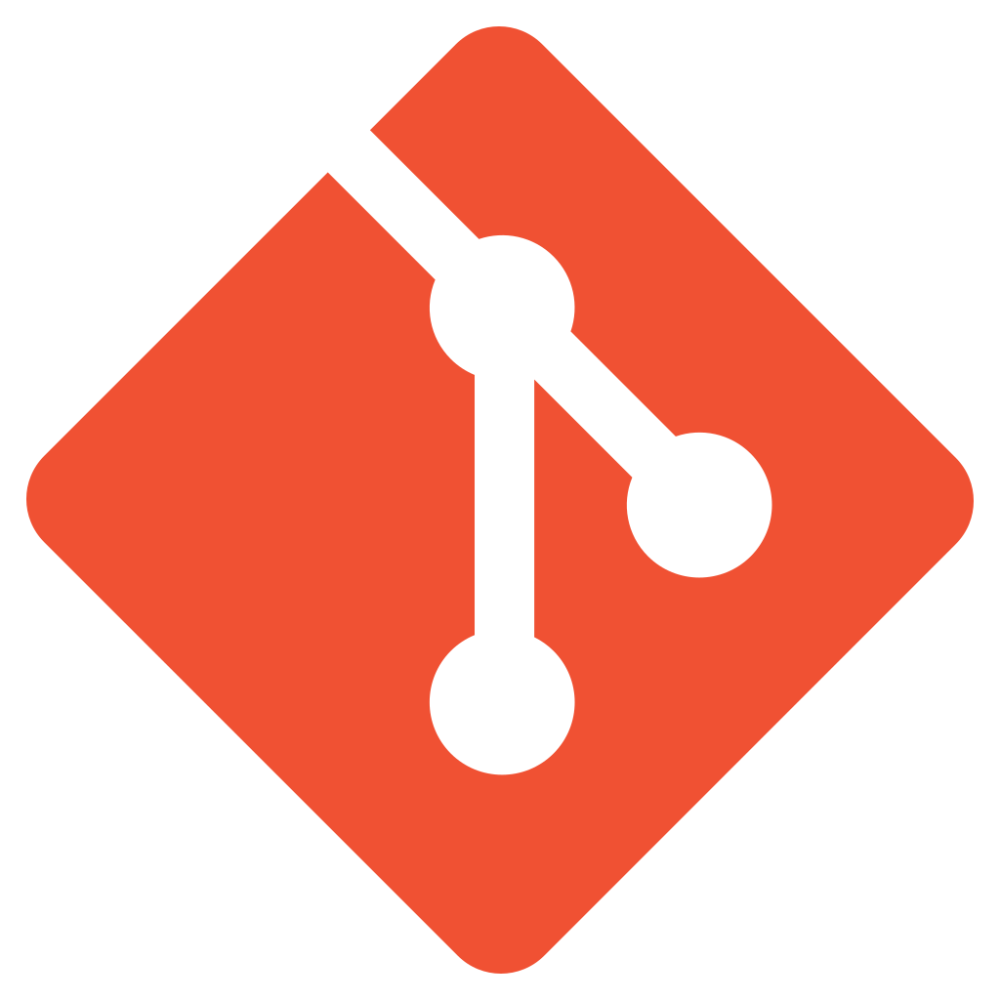
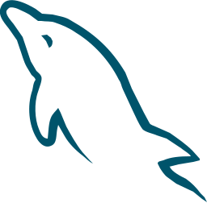
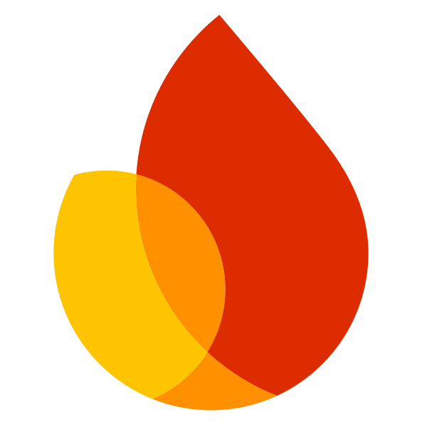

# 
Hi 👋, I'm Baalavignesh Arunachalam

  <h3>Software Engineer | Full Stack Developer | iOS</h3>
  
Full-stack developer with 2+ years professional experience in cloud computing, web, and app development. Recently shipped ByTime — a live iOS app on the App Store that lets users earn screen time by completing tasks.

  

     Portfolio: <a href="https://www.baalavignesh.com">baalavignesh.com</a> 
  

    

     App Store: <a href="https://apps.apple.com/us/app/bytime-time-hub/id6747457512">ByTime: Time Hub</a> 
  

---

### Certifications

  
  
  
  

---

### App Store

- **ByTime: Time Hub** — Available now on the Apple App Store
  - A time management app designed to help you stay on top of your schedule
  - <a href="https://apps.apple.com/us/app/bytime-time-hub/id6747457512"> Download on the App Store</a>

---

### Hackathon Achievements

- **Honorable Mention** @ Reddit & Kiro: Community Games Challenge
  - Project: TheDiggerMan
  - Incremental mining game built for Reddit with global leaderboards

- **Best Prototype Award** @ Story3 HackerEarth
  - Project: NewEnd - GenMode
  - AI-driven storytelling platform with dynamic narrative branches

- **Honorable Mentions** @ DataPalooza
  - Project: HealthHub
  - Healthcare appointment and community health alert platform

---

### Tech Stack

#### Languages & Frameworks

  
  
  
  
  
  
  

#### Cloud & DevOps

  
  
  
  
  
  

#### Databases & Tools

  
  
  
  
  
  

---

### Work Experience

- **Graduate Research Assistant** @ [George Mason University](https://www.gmu.edu/) _(Aug 2025 - Present)_
  - Modeling Bertrand competition scenarios with MARL simulations in Python and RLlib
  - Implementing Q-learning pipelines to study pricing strategy convergence and Nash equilibria
  - Presenting market dynamics insights for MBA analytics curriculum research

- **Software Engineer** @ [Motate](https://motate.io/) _(May 2025 - August 2025)_
  - Building serverless multilingual content platform using AWS Lambda/API Gateway
  - Implementing Terraform/GitHub Actions for AWS environments
  - Optimizing DynamoDB schemas with secondary indexes

- **Associate Engineer** @ [Presidio](https://www.presidio.com/) _(Sep 2023 - Jul 2024)_
  - Developed internal learning platforms and retro tools using React and AWS
  - Worked on WebRTC, CI/CD pipeline design, and mobile app development
  - Gained expertise in Azure, DevOps, Flutter, Kotlin, AWS, and React Native

- **Software Engineer Intern** @ [Toast](https://pos.toasttab.com/) _(Jun 2022 - Jul 2022)_
  - Developed full-stack application using React and AWS services
  - Implemented API Gateway, Lambda, and DynamoDB architecture
  - Optimized frontend and backend components for performance

---

 

  
  
  

